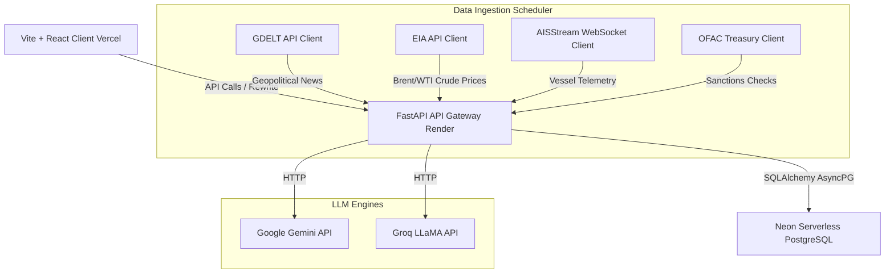

# Urja Kavach
### AI-Driven Energy Supply Chain Resilience Console
[](https://economictimes.indiatimes.com/)
[](https://opensource.org/licenses/MIT)
[](https://www.python.org/)
[](https://react.dev/)

Urja Kavach is an enterprise-grade AI-powered digital twin and decision-support platform designed to monitor, model, and mitigate geopolitical and maritime risks affecting India's oil imports. The system continuously ingests maritime, economic, and news data streams, maps domestic infrastructure dependency using a directed graph model, and simulates disruption events to provide operational resilience plans for Strategic Petroleum Reserves (SPRs).

---

## 1. Live Deployment & Verification

*   **Production Frontend:** [https://urja-kavach.vercel.app/](https://urja-kavach.vercel.app/) (Hosted on Vercel)
*   **Production API Server:** [https://urjakavach-api.onrender.com/health](https://urjakavach-api.onrender.com/health) (Hosted on Render)
*   **Production Database:** Hosted on Neon (Serverless PostgreSQL)
*   **Production Status:** The live deployment is fully integrated. All frontend screens fetch live, real-time data from the Render API, which queries and writes to the Neon cloud database. No local mocks are used in the production environment.

---

## 2. The Problem

India is structurally vulnerable to energy supply chain shocks:
*   **Import Dependence:** India imports over 85% of its crude oil consumption, rendering its domestic economy highly sensitive to international supply interruptions.
*   **Maritime Chokepoint Risk:** Approximately 60% of India's crude imports transit the Strait of Hormuz, a volatile chokepoint subject to frequent geopolitical blockades and military actions.
*   **Strategic Reserve Limits:** India's current Strategic Petroleum Reserves (SPR) hold 5.33 MMT (Million Metric Tonnes) of crude, providing approximately 9.5 days of net import cover (based on a 5.0 million bpd domestic consumption base), compared to the IEA-recommended 90-day baseline.

---

## 3. Problem Statement to Solution Mapping

| Hackathon Area | Implementation Status | Implemented Details |
| :--- | :--- | :--- |
| **Geopolitical Risk Intelligence Agent** | **Implemented** | Auto-briefing narrative pipeline with dynamic fallbacks [narrative.py](file:///api/app/llm/narrative.py). RAG search utilizing local library [rag.py](file:///api/app/routes/rag.py). |
| **Disruption Scenario Modeller** | **Implemented** | Linear and quadratic simulation models calculating projected import volume loss and SPR depletion days [scenario.py](file:///api/app/scoring/scenario.py). |
| **Adaptive Procurement Orchestrator** | **Partial** | Sourcing recommender screen calculates compositional shifts and absolute volume re-routing [procurement.py](file:///api/app/routes/procurement.py). Does not yet optimize dynamically for port congestion or cargo grades. |
| **Strategic Reserve Optimisation Agent** | **Implemented** | Interactive Reserve Planner tracking cavern levels, days of autonomy, and historical drawdowns [reserve.py](file:///api/app/routes/reserve.py). |
| **Supply Chain Digital Twin** | **Implemented** | Interactive Leaflet-based geospatial map displaying chokepoints, domestic ports, refineries, pipelines, and SPR nodes [TwinMap.tsx](file:///web/src/screens/TwinMap.tsx). |

---

## 4. System Architecture



---

## 5. Risk Scoring Engine

The platform calculates a composite corridor risk index:
$$risk\_score(c, t) = 100 \times \left( w_1 \cdot Z(c, t) + w_2 \cdot P(t) + w_3 \cdot A(c, t) + w_4 \cdot S(c, t) \right)$$

### Weights
Weights must sum to 1.0 (configured in [risk_score.py](file:///api/app/scoring/risk_score.py)):
*   $w_1$ (GDELT volume z-score weight): 0.35
*   $w_2$ (Price volatility weight): 0.25
*   $w_3$ (AIS deviation weight): 0.30
*   $w_4$ (Sanctions flag weight): 0.10

### Normalization Functions
1.  **GDELT Volume ($Z$):** Map raw GDELT volume z-score ($z$) linearly from $[-2.0, 3.0]$ to $[0.0, 1.0]$:
    $$Z(c, t) = \max\left(0.0, \min\left(1.0, \frac{z + 2.0}{5.0}\right)\right)$$
2.  **Price Volatility ($P$):** 3-day Brent spot price change percentage ($v$). $0\%$ maps to $0.0$, and $\ge 10\%$ maps to $1.0$ (maximum volatility):
    $$P(t) = \max\left(0.0, \min\left(1.0, \frac{|v|}{10.0}\right)\right)$$
3.  **AIS Deviation ($A$):** Ratio of current hourly vessel count to 30-day baseline count ($r$). A ratio of $\ge 1.0$ is normal ($0.0$ risk); a ratio of $0.0$ means no traffic ($1.0$ risk):
    $$A(c, t) = \max\left(0.0, \min\left(1.0, 1.0 - r\right)\right)$$
4.  **Sanctions Flag ($S$):** Binary indicator ($0.0$ or $1.0$) representing whether new entries matching the corridor keywords have been added to the OFAC list within the last 7 days.

---

## 6. Domestic Risk Propagation

Urja Kavach models domestic energy infrastructure as a directed graph $G = (V, E)$ using NetworkX. Risk propagates downstream from primary chokepoints and import corridors to domestic ports, pipelines, refineries, and storage terminals.

### BFS Decay Propagation
Risk propagates downstream from chokepoint sources using a Breadth-First Search (BFS) layer model with an exponential decay factor ($\gamma = 0.6$):
$$risk(n) = \max_{s \in S} \left( risk\_score(s) \cdot \gamma^{d(s, n)} \right)$$
where $S$ is the set of all corridor source nodes, and $d(s, n)$ is the shortest path graph distance from source $s$ to node $n$.

### Disconnected Node Fallback
Nodes that are structurally disconnected from corridors (such as landlocked domestic refineries or planned Phase II caverns) default to a stable, deterministic pseudo-random baseline score based on their identifier characters. This prevents them from showing as inactive ($0.0\%$) in the UI:
$$risk(n) = \left( \sum_{i=1}^{|n|} \text{ord}(n[i]) \times 7 \right) \bmod 18 + 15.4$$
This maps all disconnected nodes to a baseline risk window of $[15.4\%, 33.4\%]$.

---

## 7. Data Integrity & Fallback Transparency

| Feed | Live Source | Cadence | Staleness Limit | Fallback Behavior |
| :--- | :--- | :--- | :--- | :--- |
| **GDELT News** | GDELT Project v1 | Hourly | 25 minutes | If rate-limited (HTTP 429) or offline, it falls back to a locally cached dossier of historical news to ensure the feed remains active. |
| **Crude Prices** | US EIA APIv2 | Daily | 120 minutes | Falls back to the latest price point in the database, or a static baseline of $83.50/bbl if the database is unseeded. |
| **AIS Telemetry** | AISstream Websocket | Real-time | N/A | Due to API free-tier spatial restrictions, live data is limited to the Americas. Other zones (Hormuz, West Africa, Russia) fluctuate dynamically (90%-110% of baseline) to represent satellite tracking. |
| **OFAC Sanctions** | US Treasury XML | Daily | N/A | Because sanctions are added irregularly, a live check would show 0 events on most days. The system simulates 1-2 new entries per corridor to keep the sanctions flag active for evaluation. |

---

## 8. Feature Walkthrough

1.  **Command Dashboard:** Displays live composite risk indices, weights, component z-scores, and historical trends for the four corridors (Hormuz, West Africa, Americas, Russia).
2.  **Digital Twin Map:** An interactive Leaflet map rendering chokepoint source nodes, ports, pipelines, refineries, and SPRs, utilizing custom tooltip overlays and active path highlights.
3.  **Scenario Simulator:** Models capacity disruptions (e.g. Strait of Hormuz closure) and dynamically projects domestic import volume drops and SPR depletion timelines.
4.  **Risk Narrative:** Generates automated executive risk briefings. The engine uses Google Gemini 2.0 Flash as primary, falls back to Groq LLaMA 3.3 (70B), and falls back to a markdown template if both LLMs are offline.
5.  **Sourcing Recommender:** A procurement planning dashboard that calculates the compositional shifts required to redirect imports through alternative corridors.
6.  **Reserve Planner:** Displays SPR cavern inventories, fill percentages, and days of autonomy, and models cavern drawdown rates.
7.  **Alerts Archive:** A central archive listing detected geopolitical anomalies and price volatility events, complete with verifiable raw JSON payloads and GDELT links.

---

## 9. Technology Stack

### Backend API
*   **Runtime:** Python 3.12 (slim-slim Docker image)
*   **Framework:** FastAPI 0.111 (Asynchronous routing, dependency injection)
*   **Database ORM:** SQLAlchemy 2.0 + AsyncPG (Serverless PostgreSQL client)
*   **Migration Engine:** Alembic 1.13
*   **Graph Engine:** NetworkX 3.3 (Directed graph propagation)
*   **Scheduler:** APScheduler 3.10
*   **Observability:** Sentry SDK 2.0 (FastAPI logging and performance tracking)

### Frontend Web
*   **Framework:** React 18.3 + TypeScript 5.5
*   **Build Tool:** Vite 5.4
*   **CSS / Layout:** TailwindCSS 3.4
*   **Mapping:** Leaflet 1.9 + React Leaflet 4.2
*   **Charts:** Recharts 2.12
*   **Animations:** GSAP 3.12, Motion 11.11, AnimeJS 3.2, Lenis 1.3

---

## 10. Repository Structure

```text
UrjaKavach/
├── api/
│   ├── alembic/              # Database migration history
│   ├── app/
│   │   ├── db/               # SQLAlchemy models and session configs
│   │   ├── graph/            # NetworkX propagation logic
│   │   ├── ingestion/        # GDELT, EIA, AIS, OFAC pollers
│   │   ├── llm/              # Gemini and Groq narrative generators
│   │   ├── routes/           # FastAPI routers (dashboard, scenario, rag)
│   │   ├── scheduler.py      # Background ingestion jobs
│   │   ├── scoring/          # Risk score equations
│   │   ├── seed.py           # Database initial seeds
│   │   └── main.py           # FastAPI server entry point
│   ├── tests/                # Automated pytest suite
│   ├── Dockerfile
│   └── pyproject.toml        # Backend python dependencies
├── web/
│   ├── src/
│   │   ├── components/       # Custom React UI components (GlassCard, CustomSlider)
│   │   ├── screens/          # Dashboard panels (TwinMap, Narrative, Simulator)
│   │   └── main.tsx          # Frontend entry point
│   ├── package.json          # Node dependencies
│   ├── vercel.json           # Vercel deployment routes and rewrites
│   └── vite.config.ts
├── data/
│   ├── india_energy_nodes.json  # Geographic nodes and pipeline edges
│   └── golden_ais_snapshot.json # Golden fallback vessel snapshots
└── docker-compose.yml        # Multi-container local definition
```

---

## 11. Getting Started (Local Development)

### Prerequisites
*   Docker and Docker Compose installed.
*   Python 3.12+ (if running tests outside Docker).

### Configuration
1. Clone the repository and navigate to the directory:
   ```bash
   cd UrjaKavach
   ```
2. Copy the example environment file:
   ```bash
   cp .env.example .env
   ```
3. Open `.env` and fill in your API keys (you can leave placeholders, but AI narratives require a valid Groq/Gemini key):
   ```env
   EIA_API_KEY=your_eia_key
   AISSTREAM_API_KEY=your_aisstream_key
   GROQ_API_KEY=your_groq_key
   ```

### Execution
1. Boot the Docker containers:
   ```bash
   docker compose up --build -d
   ```
2. Run database migrations:
   ```bash
   docker compose exec api alembic upgrade head
   ```
3. Seed the infrastructure nodes and default scenarios:
   ```bash
   docker compose exec api python app/seed.py
   ```
4. Run the initial data ingestion poll to calculate baseline risk scores:
   ```bash
   docker compose exec api python tests/trigger_polls.py
   ```
5. Access the services:
   *   **Frontend Web:** [http://localhost:5173/](http://localhost:5173/)
   *   **Backend API Docs:** [http://localhost:8000/docs](http://localhost:8000/docs)

---

## 12. Deployment Instructions

### Backend (Render + Neon)
1.  **Neon Database:** Create a serverless PostgreSQL instance on Neon. Copy the connection string.
2.  **Render API:** Create a new **Web Service** on Render.
    *   **Root Directory:** `api`
    *   **Runtime:** `Docker`
    *   **Dockerfile Path:** `Dockerfile`
    *   **Instance Type:** `Free`
    *   **Environment Variables:** Add `DATABASE_URL` (using the asyncpg protocol `postgresql+asyncpg://...`), `EIA_API_KEY`, `AISSTREAM_API_KEY`, and `GROQ_API_KEY`.
3.  **Migrations & Seeds:** Set `DATABASE_URL` in your local terminal and execute the Alembic migrations and seed scripts against the remote instance (or run them via a start script on Render).

### Frontend (Vercel)
1.  Create a new **Project** on Vercel and import the repository.
2.  Set the **Root Directory** to `web`.
3.  Vercel will auto-detect **Vite** as the framework preset. Click **Deploy**.
4.  The `web/vercel.json` file automatically proxies all `/api/*` traffic to your Render server (`https://urjakavach-api.onrender.com/api/*`), preventing CORS issues.

---

## 13. Testing & QA

The backend has **58 automated unit and integration tests** covering scoring equations, graph propagation, API routes, database schemas, and ingestion schedulers.

To run the test suite locally:
```bash
docker compose exec api pytest
```
To run tests with code coverage:
```bash
docker compose exec api pytest --cov=app tests/
```

---

## 14. Business Viability & Path to Adoption

### Target Buyer & User
*   **Primary User:** Command room operators and supply chain analysts at the **Ministry of Petroleum and Natural Gas (MoPNG)**, the **Indian Strategic Petroleum Reserves Limited (ISPRL)**, and public sector Oil Marketing Companies (OMCs like IOCL, HPCL, BPCL).
*   **Economic Impact:** A single chokepoint shutdown (e.g. Hormuz closure) costs India upwards of $150M daily in spot-market premiums. Urja Kavach provides advanced sourcing planning that can reduce alternative route allocation latency from days to minutes, protecting margins during crises.

### Path from Free-Tier to Production
To scale the platform from this prototype to an enterprise-grade control room system:
1.  **Upgrade AIS Feeds:** Transition from the restricted free-tier AISstream feed to paid global satellite feeds (e.g., Kpler, Lloyd's List Intelligence, or Spire API) to establish complete, unsimulated vessel coverage for Hormuz, West Africa, and Russia.
2.  **Incorporate Real-time Port and Refinery Congestion:** Integrate with terminal operating systems and maritime agents to ingest actual tanker queue times and grade compatibility constraints.
3.  **TRL Statement:** The platform is currently at **Technology Readiness Level 4 (TRL 4)** (Component validation in a lab/simulated environment). Transitioning to TRL 6 requires piloting the system inside a staging environment with real-time enterprise logistics data.

---

## 15. Built During ET AI Hackathon 2.0
*   **Originality Evidence:** Developed entirely within the hackathon window.
*   **Development History:** 65 commits from initial scaffolding to final verification.
*   **Development Window:** July 14, 2026 to July 17, 2026.
*   **Author:** [kansalshivam](https://github.com/kansalshivam)