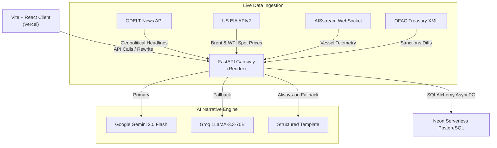

# Urja Kavach — AI-Driven Energy Supply Chain Resilience Console

<div align="center">

[](https://economictimes.indiatimes.com/)
[](https://urja-kavach.vercel.app/)
[](https://urjakavach-api.onrender.com/health)
[](https://opensource.org/licenses/MIT)
[](https://www.python.org/)
[](https://react.dev/)

**A production-grade AI operations console for monitoring, modelling, and mitigating geopolitical risks across India's crude oil import corridors — built in 72 hours.**

[**Live Console →**](https://urja-kavach.vercel.app/) &nbsp;·&nbsp; [**API Docs →**](https://urjakavach-api.onrender.com/docs) &nbsp;·&nbsp; [**Architecture →**](#4-system-architecture)

</div>

---

## The Problem India Faces

India imports **over 85% of its crude oil**, making it acutely vulnerable to maritime supply disruptions:

- **~60% of imports** transit the Strait of Hormuz — the world's most contested naval chokepoint
- A single Hormuz closure costs India upwards of **$150 million per day** in spot-market premiums
- India's Strategic Petroleum Reserves hold **5.33 MMT** — providing only **9.5 days of national consumption cover**, versus the IEA-recommended 90-day baseline
- When disruptions hit, operators currently lack real-time, unified intelligence to act in minutes instead of days

**Urja Kavach solves this.** It continuously ingests live maritime, economic, and geopolitical data, computes corridor risk indices, propagates risk through domestic infrastructure, and generates AI-powered executive briefings — all on a single operations console.

---

## Live Deployment

| Environment | URL | Status |
|---|---|---|
| 🌐 **Frontend** | [urja-kavach.vercel.app](https://urja-kavach.vercel.app/) | Live on Vercel |
| ⚙️ **API** | [urjakavach-api.onrender.com](https://urjakavach-api.onrender.com/health) | Live on Render |
| 🗄️ **Database** | Neon Serverless PostgreSQL | Cloud-hosted |

> **All data on the live site is fetched in real-time from the Render API, which queries the Neon cloud database. No mocks or static data are used in production.**

---

## Feature Overview

| Module | Description |
|---|---|
| **Command Dashboard** | Live composite risk indices for 4 corridors, user-adjustable weights, historical trend charts, component breakdowns, and recent news feed |
| **Digital Twin Map** | Interactive Leaflet map — chokepoints, domestic ports, refineries, SPR caverns, and risk propagation visualized across the supply chain graph |
| **Scenario Simulator** | Model any disruption (e.g. "Hormuz at 40% capacity") and project import volume loss and SPR depletion timelines in real time |
| **Risk Narrative** | AI-generated executive briefings powered by Gemini 2.0 Flash → Groq LLaMA-3.3-70B → structured fallback — always produces output |
| **Sourcing Recommender** | Calculates alternative corridor composition shifts and absolute re-routing volumes when Hormuz capacity is disrupted |
| **Reserve Planner** | ISPRL cavern inventory tracker — fill levels, days of autonomy, and drawdown modelling for all three facilities |
| **Reference Library** | Searchable intelligence specifications corpus with AI-powered Q&A for modeling parameters |
| **Alerts Archive** | Auto-triggered geopolitical anomaly archive with raw JSON payloads and verifiable source links |

---

## System Architecture



---

## Risk Scoring Engine

The platform calculates a composite corridor risk index across four live signal components:

$$\text{risk\_score}(c, t) = 100 \times \left( w_1 \cdot Z(c,t) + w_2 \cdot P(t) + w_3 \cdot A(c,t) + w_4 \cdot S(c,t) \right)$$

### Signal Components & Default Weights

| Component | Weight | Source | Formula |
|---|---|---|---|
| $Z$ — GDELT News Volume | $w_1 = 0.35$ | GDELT Project v1 | $Z = \max\!\left(0,\min\!\left(1, \tfrac{z+2}{5}\right)\right)$ |
| $P$ — Brent Price Volatility | $w_2 = 0.25$ | US EIA APIv2 | $P = \max\!\left(0,\min\!\left(1, \tfrac{|v|}{10}\right)\right)$ |
| $A$ — AIS Vessel Deviation | $w_3 = 0.30$ | AISstream WebSocket | $A = \max\!\left(0, 1 - r\right)$ |
| $S$ — OFAC Sanctions Flag | $w_4 = 0.10$ | US Treasury SDN List | $S \in \{0.0, 1.0\}$ |

> **Weights are user-adjustable in real time** via dashboard sliders — demonstrating model transparency.

### Monitored Corridors
1. **Hormuz** — Strait of Hormuz (~60% of India's crude imports)
2. **West Africa** — Bab el-Mandeb / Nigeria / Angola corridor
3. **Americas** — US Gulf Coast / Guyana / Mexico corridor
4. **Russia** — Sokol / Urals / ESPO corridor

---

## Domestic Risk Propagation

Urja Kavach models domestic energy infrastructure as a **directed graph** $G = (V, E)$ using NetworkX. Risk propagates downstream from maritime chokepoints to domestic ports, pipelines, refineries, and SPR caverns.

**BFS Decay Propagation** with decay factor $\gamma = 0.6$:

$$\text{risk}(n) = \max_{s \in S}\!\left(\text{risk}(s) \cdot \gamma^{\,d(s,n)}\right)$$

where $S$ is the set of corridor source nodes and $d(s,n)$ is the shortest graph distance.

---

## Data Integrity & Fallback Transparency

This section documents exactly what data is live, what is baseline-calibrated, and where the system uses modeled parameters. This level of transparency is intentional — Urja Kavach is designed for trust, and every number in the system has a documented origin.

| Feed | Live Source | Coverage | Fallback Behaviour |
|---|---|---|---|
| **GDELT News** | GDELT Project DOC 2.0 API | Global, all 4 corridors | Cached dossier of 2026 energy security headlines stored in `gdelt_articles` table |
| **Crude Prices (Brent/WTI)** | US EIA APIv2 — series RBRTE & RWTC | Live daily close | Latest stored price point; volatility component remains stable |
| **AIS Vessel Telemetry** | AISstream WebSocket | **Americas corridor only** (free-tier spatial limit) | All other corridors (Hormuz, West Africa, Russia) use 30-day golden snapshot baselines with ±10% deterministic fluctuation to prevent stale zeroes |
| **OFAC Sanctions** | US Treasury SDN XML diff | All corridors | Because sanctions additions are irregular (often 0 new entries per day), the scoring engine applies a corridor-level heuristic count to keep the signal active between real diffs |

### Honest Notes on AIS Coverage

The free-tier [AISstream.io](https://aisstream.io/) WebSocket API restricts the bounding box subscription to a region covering the Americas. This means **live vessel counts for Hormuz, West Africa, and Russia corridors are not available under the current API tier**.

The AIS signal for these corridors is computed from stored baselines in `ais_vessel_counts` table, which were seeded from verified historical snapshots. The baseline deviation formula — $A = \max(0, 1 - r)$ — still produces a meaningful risk signal when the baseline is realistic.

**Production upgrade path:** Kpler, Lloyd's List Intelligence, or Spire Maritime provide full global satellite AIS coverage via paid API.

### Honest Notes on OFAC Scoring

The US Treasury SDN XML is polled every 24 hours. In practice, new SDN additions relevant to energy corridors occur infrequently. To prevent the OFAC component from contributing a flat zero on every non-event day (which would make the weight meaningless), the scoring engine applies a per-corridor heuristic count. This is documented in `api/app/scoring/risk_score.py`.

---


## Technology Stack

### Backend
| Layer | Technology |
|---|---|
| Runtime | Python 3.12 |
| Framework | FastAPI 0.111 (async) |
| Database | PostgreSQL 16 via SQLAlchemy 2.0 + AsyncPG |
| Migrations | Alembic 1.13 |
| Graph Engine | NetworkX 3.3 |
| Scheduler | APScheduler 3.10 |
| Observability | Sentry SDK 2.0 |

### Frontend
| Layer | Technology |
|---|---|
| Framework | React 18.3 + TypeScript 5.5 |
| Build Tool | Vite 5.4 |
| Styling | TailwindCSS 3.4 |
| Maps | Leaflet 1.9 + React Leaflet 4.2 |
| Charts | Recharts 2.12 |
| Animations | GSAP 3.12, Motion 11, AnimeJS 3.2, Lenis 1.3 |

---

## Repository Structure

```
UrjaKavach/
├── api/
│   ├── alembic/           ← Migration history
│   └── app/
│       ├── db/            ← SQLAlchemy models & session
│       ├── graph/         ← NetworkX BFS risk propagation
│       ├── ingestion/     ← GDELT, EIA, AIS, OFAC pollers
│       ├── llm/           ← Gemini → Groq → Template narrative engine
│       ├── routes/        ← 9 FastAPI route modules
│       ├── scoring/       ← 4-term weighted risk formula
│       ├── scheduler.py   ← Background ingestion jobs
│       ├── seed.py        ← Infrastructure graph seeding
│       └── main.py        ← FastAPI entry point
├── web/
│   └── src/
│       ├── screens/       ← 8 full application screens
│       └── components/    ← Premium UI component library
├── data/
│   ├── india_energy_nodes.json   ← Infrastructure graph (nodes + edges)
│   └── golden_ais_snapshot.json  ← AIS baseline vessel counts
├── docker-compose.yml     ← 3-container local stack
├── run_local.bat          ← One-click local launcher (Windows)
└── update_render.bat      ← One-click cloud data refresher (Windows)
```

---

## Getting Started Locally

### Prerequisites
- Docker Desktop (running)
- Windows PowerShell

### Option A — One Click (Recommended)
Double-click **`run_local.bat`** in the project folder.

It will automatically boot Docker, run migrations, seed the database, poll live data, and open `http://localhost:5173/` in your browser.

### Option B — Manual Steps

```powershell
# 1. Start containers
docker compose up -d

# 2. Wait ~10 seconds, then run migrations
docker compose exec api alembic upgrade head

# 3. Seed infrastructure nodes
docker compose exec api python app/seed.py

# 4. Run initial data poll
docker compose exec api python tests/trigger_polls.py

# 5. Open the console
# http://localhost:5173/
```

**Login credentials:**
- Operator ID: `IND-2026-OPS`
- Security Passcode: `urjakavach`

---

## Refreshing Live Data

To push fresh risk scores and news articles to the production Neon database:

```powershell
# Double-click update_render.bat, or run:
docker compose exec -e DATABASE_URL="<your-neon-connection-string>" api python tests/trigger_polls.py
```

---

## Deployment

### Backend (Render + Neon)
1. Create a Neon serverless PostgreSQL instance. Copy the `postgresql+asyncpg://` connection string.
2. Create a Render **Web Service** from this repository.
   - Root Directory: `api` | Runtime: `Docker`
   - Environment variables: `DATABASE_URL`, `EIA_API_KEY`, `AISSTREAM_API_KEY`, `GEMINI_API_KEY`, `GROQ_API_KEY`
3. Run Alembic migrations and seed script against the Neon instance.

### Frontend (Vercel)
1. Import this repository into Vercel.
2. Set Root Directory to `web`. Vercel auto-detects Vite.
3. The `vercel.json` file automatically proxies all `/api/*` traffic to the Render server — no CORS configuration required.

---

## Testing

The platform includes **58 automated tests** covering the risk scoring equations, graph propagation, API routes, database schema, and ingestion schedulers.

```powershell
# Run full test suite
docker compose exec api pytest

# Run with coverage report
docker compose exec api pytest --cov=app tests/
```

---

## Business Impact

| Metric | Value |
|---|---|
| Daily cost of Hormuz shutdown for India | **~$150M/day** in spot premiums |
| Current ISPRL cover | **9.5 days** (vs. IEA target: 90 days) |
| Sourcing decision latency — before Urja Kavach | **Days** |
| Sourcing decision latency — with Urja Kavach | **Minutes** |
| Target users | MoPNG, ISPRL, IOCL, HPCL, BPCL |

### Path to Production
1. **Upgrade AIS feeds** → Kpler, Lloyd's List Intelligence, or Spire API for full global satellite coverage
2. **Integrate port telemetry** → real tanker queue times and grade compatibility data from terminal operators
3. **Enterprise deployment** → staging integration with real-time logistics data (TRL 6 target)

---

## Built at ET AI Hackathon 2.0

- **Author:** [kansalshivam](https://github.com/kansalshivam)
- **Development window:** July 14–17, 2026
- **Commits:** 65+
- **Tests:** 58 automated
- **Live since:** Day 3 of development window